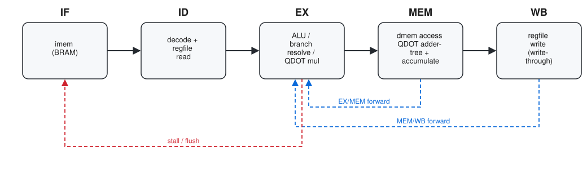

# RISC-V — Pipelined RV32I Core with a Custom INT8 Dot-Product Extension

[](https://github.com/Sanjayarasu-M/RISC-V/actions/workflows/ci.yml)
[](LICENSE)
[](scripts/run_tests.sh)

A from-scratch RISC-V CPU in Verilog: a 5-stage pipelined RV32I core with full
data forwarding and hazard handling, extended with two custom instructions
(`QDOT4` / `QDOT8`) that accelerate signed int8 dot products — the operation
at the heart of quantized neural-network inference — directly in hardware.
The project also includes a bare-metal C toolchain flow, a self-checking
testbench suite, and an FPGA deployment target (CPU + UART) that has been
synthesized and routed clean for a Xilinx Zynq UltraScale+ part.

All functional claims in this README (test results, cycle counts, speedups,
FPGA utilization/timing) were verified by actually running the toolchain —
Icarus Verilog for simulation, Vivado 2025.2 for synthesis/implementation —
against this repository; see [Verified results](#verified-results) and
[FPGA synthesis](#fpga-synthesis).

## Contents

- [Highlights](#highlights)
- [Repository layout](#repository-layout)
- [Architecture](#architecture)
- [The QDOT4 / QDOT8 extension](#the-qdot4--qdot8-extension)
- [Getting started](#getting-started)
- [Building and running the tests](#building-and-running-the-tests)
- [Rebuilding the firmware image](#rebuilding-the-firmware-image)
- [FPGA synthesis](#fpga-synthesis)
- [Verified results](#verified-results)
- [Known limitations](#known-limitations)
- [Project history](#project-history)
- [Contributing](#contributing)
- [License](#license)

## Highlights

- **5-stage pipelined RV32I core** (`rtl/cpu_core.v`): IF → ID → EX → MEM →
  WB, full RV32I integer ISA (LUI, AUIPC, JAL, JALR, all branches, all
  loads/stores including byte/halfword, all register-immediate and
  register-register ALU ops).
- **Full hazard handling**: EX/MEM and MEM/WB forwarding into EX; a 1-cycle
  load-use stall (generalized to also cover `QDOT4`/`QDOT8`, since both
  produce their result at the same pipeline point as a load); predict-not-taken
  branches resolved in EX (2-bubble flush when redirected) and JAL resolved in
  ID (1-bubble flush, since it needs no register operands).
- **Custom SIMD dot-product-accumulate instructions**, `QDOT4` and `QDOT8`
  (custom-0 opcode), for signed int8 lanes packed into 32-bit registers —
  analogous in spirit to Arm's `SDOT` or RISC-V's emerging matrix/vector
  extensions. Pipelined across EX (multiply) and MEM (adder tree +
  accumulate) so they don't sit on the critical path.
- **A single-cycle reference core** (`rtl/cpu_core_singlecycle.v`) is kept
  alongside the pipelined one for comparison; it is not part of the build any
  of the testbenches use.
- **BRAM-inferring memories** (`rtl/top.v`): synchronous-read instruction and
  data memories, matching the template Vivado maps to Xilinx Block RAM.
- **Bare-metal C firmware** (`sw/`): a minimal `crt0.S` startup, a linker
  script for the core's Harvard memory layout, and a kernel that computes the
  same dot product three ways (plain RV32I loop, `QDOT4`, `QDOT8`) and
  cross-checks the results. Custom instructions are issued from C with the
  standard `.insn` directive — no patched assembler required.
- **FPGA deployment target** (`fpga/`): `fpga_top.v` adds a UART transmitter
  so the core can report results off-chip, plus a Vivado batch-mode
  synthesis/implementation script targeting a Zynq UltraScale+ part
  (`xczu7ev-ffvf1517-1LV-i`). Synthesized and routed clean with Vivado
  2025.2 — 0 errors/warnings, all timing constraints met at 50 MHz,
  <1% LUT/FF/BRAM utilization. See [FPGA synthesis](#fpga-synthesis) for
  the full report.
- **Self-checking testbenches** throughout: every `.v` testbench in this
  repository prints `PASS`/`FAIL` and is driven by a matching hand-assembled
  or GCC-compiled program.

## Repository layout

```
RISC-V/
├── rtl/                      Core CPU RTL (synthesizable)
│   ├── alu.v                 RV32I ALU
│   ├── regfile.v              32x32-bit register file (5 read ports, 1 write port)
│   ├── qdot4.v                QDOT4/QDOT8 multiply + adder-tree/accumulate datapath
│   ├── cpu_core.v             5-stage pipelined RV32I + QDOT4/QDOT8 core (primary)
│   ├── cpu_core_singlecycle.v Original single-cycle core, kept for reference
│   └── top.v                  Simulation top level: core + BRAM-style imem/dmem
├── tb_top.v / program.s / program.hex
│                              Flagship smoke test: hand-assembled QDOT4 program
├── tests/                    Self-checking pipeline hazard / QDOT8 regression suite
│   ├── hazard_*.s / .hex      Hand-assembled hazard stress tests (branch, load-use,
│   │                          back-to-back QDOT4/QDOT8 dependencies)
│   ├── qdot8_basic.s / .hex   Basic QDOT8 correctness test
│   └── tb_hazard_*.v, tb_qdot8_basic.v
├── sw/                        Bare-metal C firmware + benchmark
│   ├── crt0.S, link.ld        Startup code and linker script
│   ├── kernel.c                scalar vs. QDOT4 vs. QDOT8 dot-product kernel
│   ├── kernel.hex, kernel_data.hex  Pre-built memory images (see below)
│   ├── bin2hex.py             Raw binary -> $readmemh hex converter
│   ├── tb_kernel.v            Correctness check (scalar == QDOT4 == QDOT8)
│   └── tb_benchmark.v         Cycle-accurate benchmark of all three kernels
├── fpga/                      FPGA deployment target
│   ├── fpga_top.v             CPU + BRAM + UART TX peripheral
│   ├── uart_tx.v, uart_rx.v   UART transmitter / receiver
│   ├── uart_demo.s / .hex     Demo program: writes "OK" over UART
│   ├── constraints.xdc        Timing constraints (no real board pin mapping yet)
│   ├── synth.tcl              Vivado batch-mode synthesis + implementation script
│   ├── query_bram.tcl         Post-implementation BRAM-mapping check
│   └── tb_uart.v, tb_fpga_top.v  UART loopback test and end-to-end UART demo test
├── scripts/run_tests.sh       Compiles + runs every testbench; used by CI and locally
├── .github/workflows/ci.yml   GitHub Actions: runs scripts/run_tests.sh on push/PR
├── docs/architecture.svg      Pipeline diagram embedded in this README
├── LICENSE, README.md, CHANGELOG.md, CONTRIBUTING.md, .gitignore, .gitattributes
```

## Architecture



- **Forwarding**: EX/MEM and MEM/WB results are forwarded back into EX for
  `rs1`, `rs2`, `rd`-as-source (QDOT accumulate input), and the QDOT8
  register-pair partners `rs1+1`/`rs2+1`.
- **Stalls**: a load, `QDOT4`, or `QDOT8` in EX whose destination is needed
  immediately by the next instruction inserts one bubble (its result isn't
  ready until the end of MEM).
- **Control flow**: `BRANCH`/`JALR` resolve in EX using forwarded operands
  (predict-not-taken, 2-bubble flush if redirected); `JAL` resolves in ID
  (1-bubble flush, unconditional and register-free).
- Both instruction and data memories are **synchronous-read** (registered
  output), matching Xilinx Block RAM behavior — the IF stage accounts for
  this with an extra pipeline buffer (`if_id_instr`) and a "stall echo" that
  re-squashes a wrong-path fetch that was already in flight when a hazard or
  redirect is detected. See the detailed header comments in
  `rtl/cpu_core.v` for the full reasoning (including two real bugs this
  design had to work around, each pinned down by a specific regression test).

## The QDOT4 / QDOT8 extension

Both instructions live at the RISC-V **custom-0** opcode (`0001011`, i.e.
`0x0B`), distinguished by `funct3`:

| Instruction | `funct3` | Semantics |
|---|---|---|
| `QDOT4 rd, rs1, rs2` | `0` | `rd = rd + Σ(i=0..3) rs1[i] * rs2[i]`, signed int8 lanes packed in `rs1`/`rs2` |
| `QDOT8 rd, rs1, rs2` | `1` | `rd = rd + Σ(i=0..7) A[i] * B[i]`, where `A = rs1 ++ (rs1+1)`, `B = rs2 ++ (rs2+1)` |

`QDOT8` needs 8 lanes of input but a 32-bit register field only encodes 4, so
it uses the register-pair trick common to ISAs facing the same problem
(RISC-V Zdinx, Arm register pairs, etc.): the second 4 lanes come from
whatever physical register sits immediately above `rs1`/`rs2`. This means
**`x31` cannot be used as a `QDOT8` `rs1` or `rs2` operand** — the `+1`
computation wraps to `x0` (see [Known limitations](#known-limitations)).

Both instructions are pipelined across **EX** (four/eight signed 8×8
multiplies) and **MEM** (adder tree + accumulate against `rd`), so their
result becomes available at the same pipeline point as a load and is handled
by the exact same forwarding/stall logic.

From C, both are issued with the standard `.insn` directive — no assembler
patch needed:

```c
// QDOT4
asm volatile (".insn r 0x0B, 0, 0, %0, %1, %2" : "+r"(acc) : "r"(a), "r"(b));

// QDOT8 (rs1/rs1+1 and rs2/rs2+1 pinned to adjacent hardware registers
// with GCC's local register-variable extension)
asm volatile (".insn r 0x0B, 1, 0, %0, %1, %2"
              : "+r"(rd_) : "r"(rs1_), "r"(rs2_), "r"(rs1h_), "r"(rs2h_));
```

See `sw/kernel.c` for the complete, working example.

## Getting started

### Prerequisites

| Tool | Required for | Verified with |
|---|---|---|
| [Icarus Verilog](https://steveicarus.github.io/iverilog/) (`iverilog`, `vvp`) | All simulation/testbenches | 13.0 (stable) |
| A RISC-V bare-metal GCC (`riscv32-unknown-elf-gcc`) | Only if you want to rebuild `sw/*.hex` from `sw/kernel.c` | GCC 14.2.0 |
| Python 3 | `sw/bin2hex.py` (only needed alongside the GCC rebuild step) | 3.14 |
| Xilinx Vivado | Only for `fpga/synth.tcl` (synthesis/implementation) | Scripted against 2025.2; not required for simulation |

All simulation commands below only need Icarus Verilog and should be run
from the repository root, since a few default memory-image paths
(`program.hex`, `sw/kernel.hex`) are relative to the current directory.

## Building and running the tests

Every command below was run against this exact repository state and its
output is reproduced verbatim in [Verified results](#verified-results).
`./scripts/run_tests.sh` runs all of them in sequence and exits non-zero if
any test prints `FAIL` or produces no `PASS` output — it's what
[CI](.github/workflows/ci.yml) runs on every push and pull request, and the
fastest way to reproduce the full suite locally:

```sh
./scripts/run_tests.sh
```

The individual commands below are the same thing broken out per test, useful
when you're debugging one specific testbench.

**Flagship smoke test** (hand-assembled `QDOT4` program, `program.hex`):

```sh
iverilog -o tb_top.vvp tb_top.v rtl/top.v rtl/cpu_core.v rtl/alu.v rtl/regfile.v rtl/qdot4.v
vvp tb_top.vvp
```

**Pipeline hazard / QDOT8 regression suite** (`tests/`, one command per test):

```sh
for t in hazard_branch hazard_loaduse hazard_qdot4 hazard_qdot8 hazard_qdot8_hi qdot8_basic; do
  iverilog -o /tmp/tb_$t.vvp tests/tb_$t.v rtl/top.v rtl/cpu_core.v rtl/alu.v rtl/regfile.v rtl/qdot4.v
  vvp /tmp/tb_$t.vvp
done
```

**Firmware correctness and benchmark** (`sw/`, uses the pre-built
`sw/kernel.hex` / `sw/kernel_data.hex`):

```sh
iverilog -o tb_kernel.vvp sw/tb_kernel.v rtl/top.v rtl/cpu_core.v rtl/alu.v rtl/regfile.v rtl/qdot4.v
vvp tb_kernel.vvp

iverilog -o tb_benchmark.vvp sw/tb_benchmark.v rtl/top.v rtl/cpu_core.v rtl/alu.v rtl/regfile.v rtl/qdot4.v
vvp tb_benchmark.vvp
```

> `tb_benchmark.vvp` prints a benign `$readmemh: Not enough words in the
> file for the requested range [0:1023]` warning for both memory images —
> the default `MEM_WORDS` is 1024 (4KB) and the firmware image is smaller.
> This is expected, not an error.

**UART peripheral and FPGA top level** (`fpga/`):

```sh
iverilog -o tb_uart.vvp fpga/tb_uart.v fpga/uart_tx.v fpga/uart_rx.v
vvp tb_uart.vvp

iverilog -o tb_fpga_top.vvp fpga/tb_fpga_top.v fpga/fpga_top.v fpga/uart_tx.v fpga/uart_rx.v rtl/cpu_core.v rtl/alu.v rtl/regfile.v rtl/qdot4.v
vvp tb_fpga_top.vvp
```

All 6 `tests/` testbenches, both `sw/` testbenches, and both `fpga/`
testbenches passed when last verified against this repository state.

## Rebuilding the firmware image

`sw/kernel.hex` and `sw/kernel_data.hex` are committed so the `sw/` and
`fpga/` testbenches run out of the box without a RISC-V toolchain. They are
fully reproducible from source, e.g. with a `riscv32-unknown-elf-gcc`
bare-metal toolchain:

```sh
cd sw
riscv32-unknown-elf-gcc -march=rv32i -mabi=ilp32 -nostdlib -nostartfiles \
    -O2 -T link.ld -o kernel.elf crt0.S kernel.c -lgcc

riscv32-unknown-elf-objcopy -O binary -j .text        kernel.elf kernel_text.bin
riscv32-unknown-elf-objcopy -O binary -j .rodata -j .data kernel.elf kernel_data.bin

python3 bin2hex.py kernel_text.bin kernel.hex
python3 bin2hex.py kernel_data.bin kernel_data.hex
```

`-lgcc` is required because RV32I has no hardware multiply, and
`scalar_dot16`'s reference loop needs the software `__mulsi3` routine from
libgcc.

This was verified in this environment: the exact byte sequence differs
slightly from the committed `.hex` files (different GCC versions schedule
instructions differently), but a freshly rebuilt image was substituted into
`sw/tb_kernel.v` and produced the identical `PASS` results shown below —
i.e. the build is functionally reproducible, not just bit-for-bit on one
specific toolchain version.

## FPGA synthesis

`fpga/synth.tcl` is a Vivado non-project batch-mode script that synthesizes
and implements `fpga_top` (core + BRAM + UART) against a Zynq UltraScale+
part (`xczu7ev-ffvf1517-1LV-i`), and reports utilization and timing:

```sh
vivado -mode batch -source fpga/synth.tcl
```

Run from the repository root. Output reports and the routed checkpoint are
written to `fpga/build/` (git-ignored — regenerate locally rather than
committing them).

This flow was executed end-to-end with **Vivado 2025.2**
(`synth_design` → `opt_design` → `place_design` → `phys_opt_design` →
`route_design`) against the committed `sw/kernel.hex` / `kernel_data.hex`
firmware image. Result: **0 errors, 0 critical warnings, 0 warnings** across
every stage, and a routed design meeting all timing constraints.

**Post-route utilization** (`xczu7ev-ffvf1517-1LV-i`, from `fpga/build/utilization.rpt`):

| Resource | Used | Available | Utilization |
|---|---|---|---|
| CLB LUTs | 2,093 | 230,400 | 0.91% |
| CLB Registers (FF) | 775 | 460,800 | 0.17% |
| CARRY8 | 115 | 28,800 | 0.40% |
| Block RAM tiles | 1.5 (1× RAMB36E2 + 1× RAMB18E2) | 312 | 0.48% |
| DSP48 | 0 | 1,728 | 0% |
| Bonded IOB | 3 | 464 | 0.65% |
| BUFGCE (clock buffers) | 1 | 208 | 0.48% |

`imem` correctly mapped to a Block RAM (`imem_data_r_reg` → RAMB18E2) and
`dmem` to a second Block RAM (RAMB36E2) — confirming the `rom_style="block"`
attribute in `fpga_top.v` works as intended on this toolchain version (see
the comment there about the historical LUT-inference failure this attribute
was added to fix). The register file synthesized to distributed RAM (LUTRAM)
rather than flip-flops. No DSP48 blocks were used — the ALU and QDOT4/QDOT8
multiplies map entirely to CLB fabric (LUTs/CARRY8) at this utilization
level.

**Timing** (`fpga/build/timing_summary.rpt`, constrained clock: 50 MHz /
20.000 ns period, speed grade `-1LV`, temperature grade `I`):

| Metric | Value |
|---|---|
| Worst Negative Slack (setup, WNS) | +9.717 ns (0 of 3091 endpoints failing) |
| Worst Hold Slack (WHS) | +0.014 ns (0 of 3091 endpoints failing) |
| Worst Pulse Width Slack (WPWS) | +9.214 ns (0 of 980 endpoints failing) |

All user-specified timing constraints are met at 50 MHz. The positive setup
slack implies headroom above 50 MHz (critical path ≈ 20 − 9.717 = 10.283 ns,
i.e. an estimated ~97 MHz ceiling *at this specific placement*) — but that
is a router-estimated extrapolation, not a re-run at a tighter constraint,
so treat it as directional rather than a guaranteed Fmax.

**One thing worth flagging, not glossing over**: the worst hold slack is
only **+0.014 ns (14 picoseconds)** — technically passing, but an extremely
thin margin that single-corner Vivado STA can validate but real silicon
(process/voltage/temperature variation) can violate. Before trusting this on
physical hardware, re-run timing across multiple corners
(`report_timing_summary` with `-delay_type min_max` across setup/hold
corners, which this default flow already requests, but consider tightening
margins deliberately) and treat this specific hold path
(`CORE/id_ex_funct3_reg[1]` → `CORE/ex_mem_funct3_reg[1]`) as a candidate
for a small deliberate delay buffer if you take this to a real board.

`fpga/constraints.xdc` only sets a clock period — the pin/IOSTANDARD
assignments for a real board are left as commented-out placeholders. This
project has been carried through synthesis and timing closure but has not
been run on physical hardware.

## Verified results

Output of `sw/tb_benchmark.v` (64-element signed int8 dot product, measured
in-simulation via cycle-count checkpoints written by the firmware — this
core has no CSR/`rdcycle` support):

```
---------------------------------------------------
 64-element int8 dot product, pipelined 5-stage core
---------------------------------------------------
 scalar_dot16 (RV32I + soft-mul) : 1566 cycles
 qdot4_dot16  (QDOT4 accelerated): 190 cycles
 qdot8_dot16  (QDOT8 accelerated): 120 cycles
 speedup (QDOT4 vs scalar)       : 8.24x
 speedup (QDOT8 vs scalar)       : 13.05x
 speedup (QDOT8 vs QDOT4)        : 1.58x
---------------------------------------------------
```

This is a **simulation cycle-count** result, not a measurement on physical
hardware or at a specific clock frequency — no FPGA timing/fmax figure is
claimed here since none has been measured on real silicon.

## Known limitations

These are honest, code-level limitations, not bugs waiting to be filed:

- **`x31` cannot be a `QDOT8` operand.** The `rs1+1`/`rs2+1` register-pair
  address wraps 5-bit, so `x31` wraps to `x0` instead of an out-of-range
  register.
- **No trap/exception handling.** Unimplemented opcodes (e.g. `FENCE`,
  `ECALL`/`EBREAK`, any CSR instruction — this core has no Zicsr) decode as
  a silent no-op rather than trapping. Misaligned word accesses are not
  detected or corrected; the address's low 2 bits select a byte lane within
  the containing word rather than spanning a memory-word boundary.
- **The UART "peripheral" is minimal.** A single fixed write-only address
  (`0x7F0`) with no `ready`/backpressure readback to the CPU — firmware must
  pace writes with a software delay loop (see `fpga/uart_demo.s`). A real
  design would want a proper memory-mapped peripheral bus with a readable
  status register.
- `fpga/uart_rx.v` is a tested, synthesizable receiver but isn't wired into
  any bootloader protocol in this repository yet.
- **No physical board bring-up.** `fpga/constraints.xdc` has no real pin
  assignments; the FPGA flow has been taken through Vivado synthesis and
  timing closure, not tested on hardware.
- `rtl/cpu_core_singlecycle.v` is the original single-cycle implementation,
  kept only for reference/comparison — it is not wired into any current
  testbench.

## Project history

This core was built incrementally; see [CHANGELOG.md](CHANGELOG.md) for the
development milestones (single-cycle core → pipelined core with hazard
handling → firmware + cycle-accurate benchmarking → FPGA synthesis → the
QDOT8 extension) as recorded in the source history.

## Contributing

See [CONTRIBUTING.md](CONTRIBUTING.md).

## License

MIT — see [LICENSE](LICENSE).
